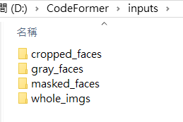

CodeFormer是相片修復模型， 缺損、打碼、老照片把臉部還原用的。
用到 CodeFormer是因為，要測試 framepacke 用照片產生影片，想用DALL-E mini 產生相片來用，結果 DALL-E mini 產生的 相片慘不忍睹，所以想用 CodeFormer 把照片變美一點，結果不理想。

這個模型的 [github ](https://[GitHub - sczhou/CodeFormer: [NeurIPS 2022] Towards Robust Blind Face Restoration with Codebook Lookup Transformer](https://github.com/sczhou/CodeFormer))說明做得很好，完全按照說明即可，過程沒有 error 或是缺東西，直接很快就可以 inference 了。

# git clone this repository

git clone https://github.com/sczhou/CodeFormer
cd CodeFormer

# create new anaconda env

conda create -n codeformer python=3.8 -y
conda activate codeformer

# install python dependencies

pip3 install -r requirements.txt
python basicsr/setup.py develop
conda install -c conda-forge dlib (only for face detection or cropping with dlib)

Download 模型

python scripts/download_pretrained_models.py facelib
python scripts/download_pretrained_models.py dlib (only for dlib face detector)

python scripts/download_pretrained_models.py CodeFormer

測試
put the testing images in the `inputs/` folder

Run :
python inference_codeformer.py -w 0.7 --input_path D:\CodeFormer\inputs\whole_imgs\terrible.png

結果 :

你覺得有救到嗎? 好像沒有。。也許原圖就已經太慘了..

其實 CodeFormer 還有其他用途，例如 : 無損放大、舊照片修復變彩色、缺損相片(例如只剩半張)修復等，有空再來試試看。
