AI 模型部署、使用，已經做了很多了，大部分大同小異，就是建構 pytohn環境 、CUDA、等等。這裡用 DALL-E文生圖，是因為很多時候 要做視頻的，需要一張圖，所以先弄個 DALL-E來用，主要是因為它 硬體需求小。

為了之後使用方便， 把 DALL-E 做成 docker image 。

1. clone git : `$git clone https://github.com/borisdayma/dalle-mini.git`
   它的 Dockerfile 放在 Docker/ 目錄下
2. `$cd dalle-mini/docker`
3. 依據 Docekr/readme.md 的說明
4. build : `$docker build . -t dalle-mini:latest` 這裡有點久，因為要去拉很多東西。

   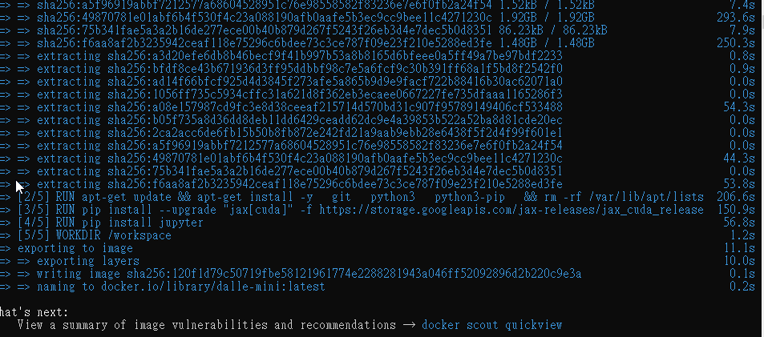
5. run 這個 docker :
   docker run --rm --name dallemini -it -p 8888:8888  --gpus all  -v "${PWD}":/workspace dalle-mini:latest

   如果是在 windows 下， 改成 :
   docker run --rm --name dallemini -it -p 8888:8888 --gpus all -v "d:\gg:/workspace" dalle-mini:latest

   用 d:\gg 指定worspace對應到 windows的實體目錄

   成功跑起來的話，會看到

   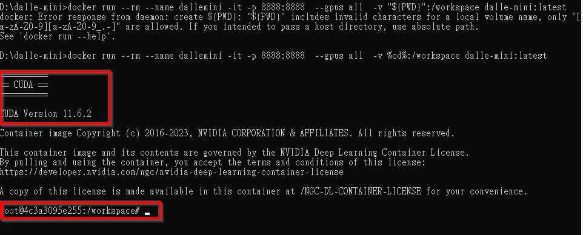

   而且已經進入 container裡面的 workspace 目錄了。
6. 把 jupyter notebook 跑起來
   `$jupyter notebook --ip 0.0.0.0 --no-browser --allow-root`
   成功的話，會看到下圖

   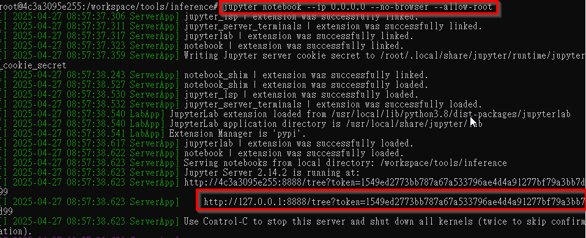
   這個網址就是 inference 的入口了， 瀏覽器打開即可。
7. double click .ipynb   notebook檔

   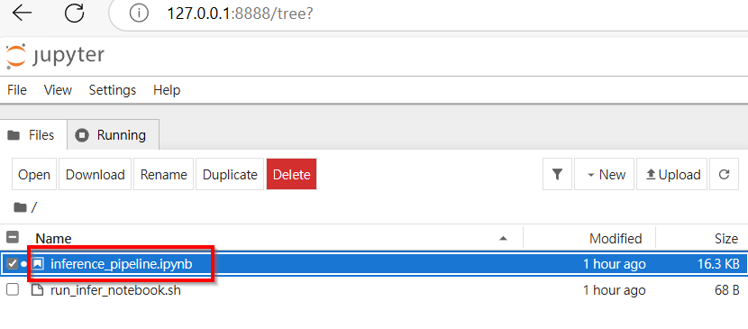

   進去就像 CoLab 一樣 ，就一步一步執行下去

   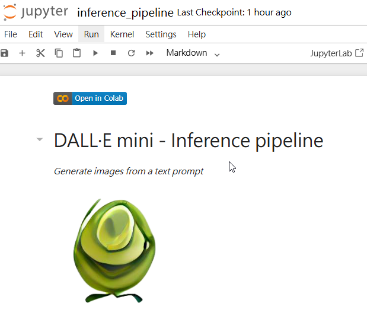
   到每一個 cell 去，然後給他按 執行 ，就會跑了

   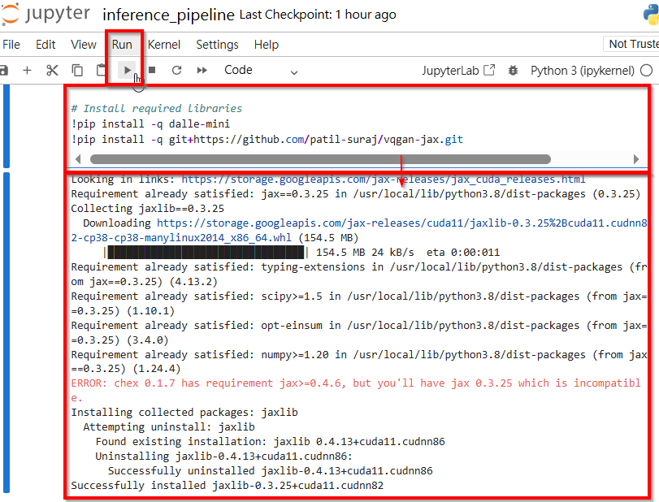
   到第4步的時候，需要 wandb.ai 的 API key (模型在那裡，需要下載)
8. 然後到 prompt 那哩，輸入你的 提示詞， 然後往下執行，就會生出 圖片了。
9. GG了， out of memory....

   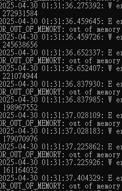

   看來玩這個還要多備點銀彈才行....
10. 把模型改小一點的，

    *if the notebook crashes too often you can use dalle-mini instead by uncommenting below line

    DALLE_MODEL = "dalle-mini/dalle-mini/mini-1:v0"，

    & 把 n_predictions = 2 降低一些看看
    prompts = [
    "A beautiful oriental girl talking on her cell phone, close-up of her face showing her big, bright eyess"
    ]
    prompt 是一個陣列，可以同時指定多個prompts 去生成多個圖片，n_predictions是每個  prompt 生成的圖片數量。

    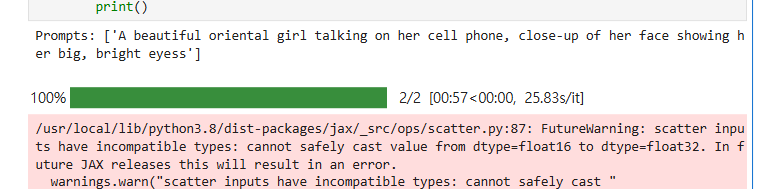
    雖然有些 error message 但還是跑完了

    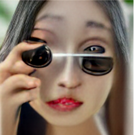

    

    好吧...結果還滿慘的... 看來 模型真的滿重要的，需要裝備好一點、載入較大較好的模型才能產出比較好的結果。 至少跑出來了。。
11. 把 promp 改一下 :
    "A highly detailed ArtStation-style portrait of an Asian woman with bright eyes and a natural smile, ultra-realistic, 8K resolution"
    再試一次
    結果30秒就生成了，但還是很嚇人...

    

    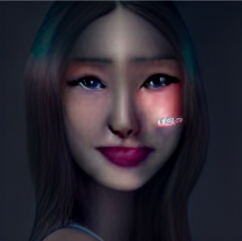
12. 用 codeformer 嘗試能不能變好一點 :

    

    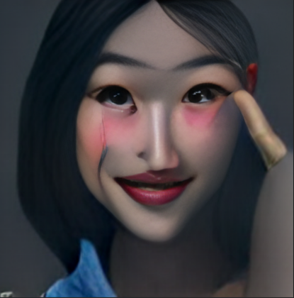
    好吧，看起來沒甚麼改善...
