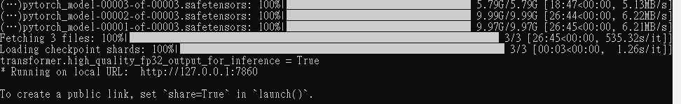
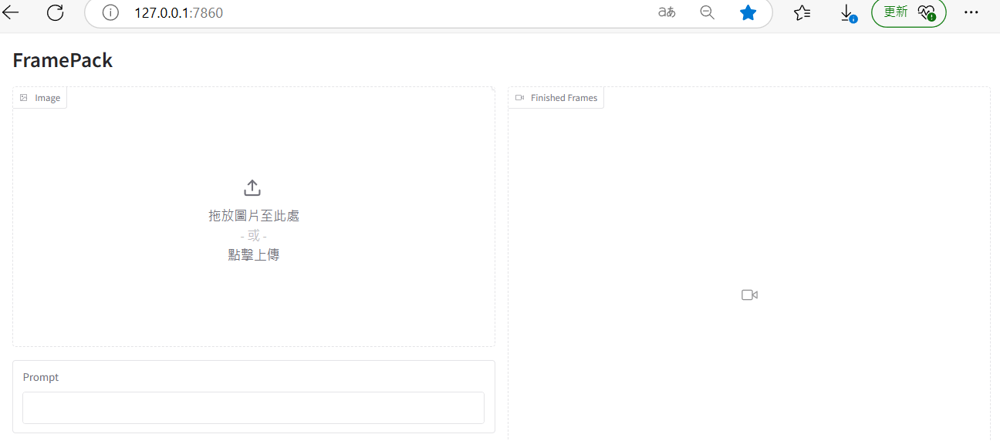
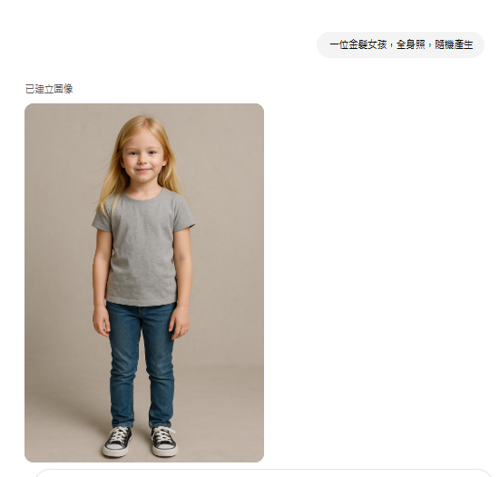
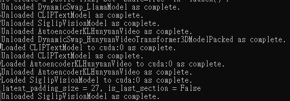
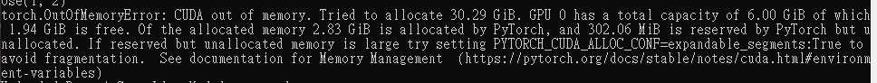
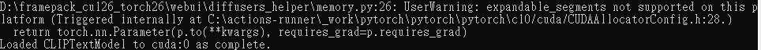
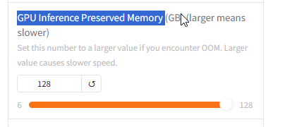

由圖片生成影片。

[github在這裡](https://[GitHub - lllyasviel/FramePack: Lets make video diffusion practical!](https://github.com/lllyasviel/FramePack))

主要特性是從輸入的照片，預測照片中人物的下一個動作，然後一個一個下去產生影片。Packing Input Frame Context in Next-Frame Prediction Models for Video Generation.

這個github也做的很方便，甚至有 one click 包，直接就能用。

整包下載回來後，記得執行 updat.bat 。

然後執行 run.bat 就行了，

在本機 7860 port 產生了 inference ，瀏覽器前往

先用 chatGpt產生一張照片，

是不是很厲害?

聽說 Gemini (Google AI Studio) 現在做圖片的功能，好像比 chatGPT還厲害了，有空可去試試看。

然後把照片傳到 FramePack 去，

在 terminal 的 FramePack inference 那裡，可以看見完整的運作過程

前端可看到經過 text encoding . vae encoding ....

又GG了.... out of memory

set PYTORCH_CUDA_ALLOC_CONF=expandable_segments:True

不支持

再試一次

FramePack 竟然顯示 CUDA out of memory. Tried to allocate 30.29 GiB.

30.29 GB?

有甚麼辦法在低 VRAM的機器上跑這個模型?
把 GPU Inference Preserved Memory 從6改到 128，還是不行

set PYTORCH_CUDA_ALLOC_CONF=max_split_size_mb:256

再來一次，還是 OOM 。 顯然號稱 6GB VRAM 可以跑? 好像不行的。

把 windows 虛擬記憶體調到 80G 以上，重開機，
set TORCH_CUDA_ALLOC_CONF=max_split_size_mb:512

GPU Inference Preserved Memory 一樣設到最大 128
結果還是 OOM。 但是同樣的機器，跑 wan2.1 是可以跑出來的。
