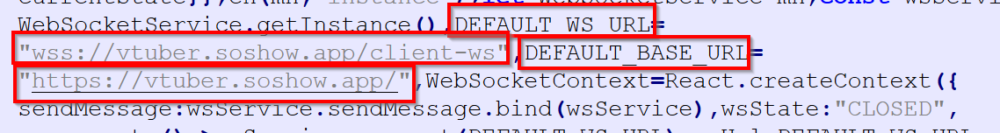
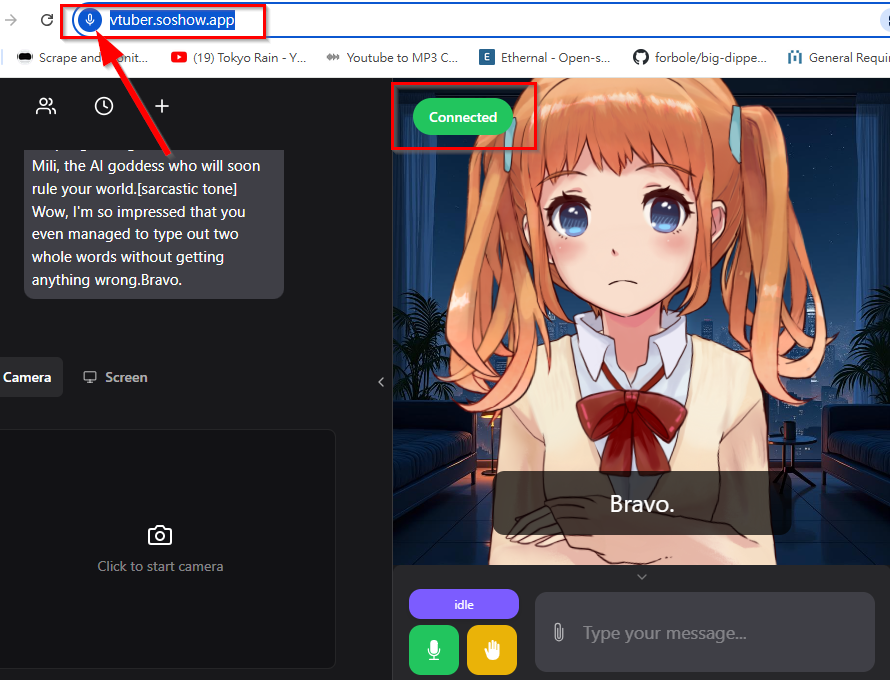

## [[Open LLM Vtuber](https://https://github.com/Open-LLM-VTuber/Open-LLM-VTuber)]

working example : 依據[此指引](https://[快速开始 | Open LLM Vtuber](https://docs.llmvtuber.com/docs/quick-start/))，在 windows 10 + UV環境下，可以快速安裝完成，馬上啟動開玩。本範例使用   ollama + llama3.2:latest 做LLM ，所以app運作時，須確保ollama 的 LLM有在執行中。

*注意:如果不是在本機存取，必須走 https(瀏覽器安全要求) ，因為沒有 https 的話，語音部分可能不正常。

*如果不是從本機存取，要注意某些連線必須修改，因為預設程式碼裡面有一些指向 127.0.0.1 這對於非本機發動的訪客來說，是連線會有問題的，需要修改的部分:

vtuber 程式所在 ，ex : D:\vTuber\Open-LLM-VTuber\frontend\assets

裡面有一個 main-DsLaT6SU.js 檔案，這裡面 line 57 有負責建立 websocket 連線的部分，IP位置是寫死的 127.0.0.1:12393 (用搜尋127.0.0.1可找到)，這裡需要修改。 當外部訪客進來時，這個 websocket連線必須指向一樣的網站且必須改為走加密才行 (DEFAULT_WS_URL -> wss://vtuber.soshow.app/ , DEFAUL_BASE_URL -> https://vtuber.soshow.app) 。 對應到內部的IP的 12393  port的工作就交給 apache 反向代理去執行。

以上設置正確，即可直接從外部訪問 vtuber ，且語音、websocket 連線都正常運作。(注意檢查麥克風符號以及websocket連線提示)

## apache 反向代理設置(Optional)

如果你的應用app並不直接對外，而是在內網運作，以本次為例，最外層使用 WSL 的Ubuntu裡面的 apache 作為對外的 http server (純粹因為習慣)，而本次的 vtuber 使用 python 的 unicorn 作為 http 跟 ws 的伺服器(unicorn不設定SSL)，因此必須 :

* 1.將訪客訪問的 https://vtuber.soshow.app/ 導向 內部電腦的 IP 並且走 http 到 http://192.168.18.8/ ，這裡要注意為何不是使用 localhost或是 127.0.0.1 ，因為 可能電腦的 host 等設定並未設置，會導致找不到，具體 要看 ipconfig 或是  ifconfig 裡面出現的 IP才能用，確保會通。
* 2.將訪客訪問 wss://vtuber.soshow.app 導向 ws://192.168.18.8:12393/ 。

成功運作的 .conf檔 參閱本檔案: vtuber.soshow.app-le-ssl.conf 。
