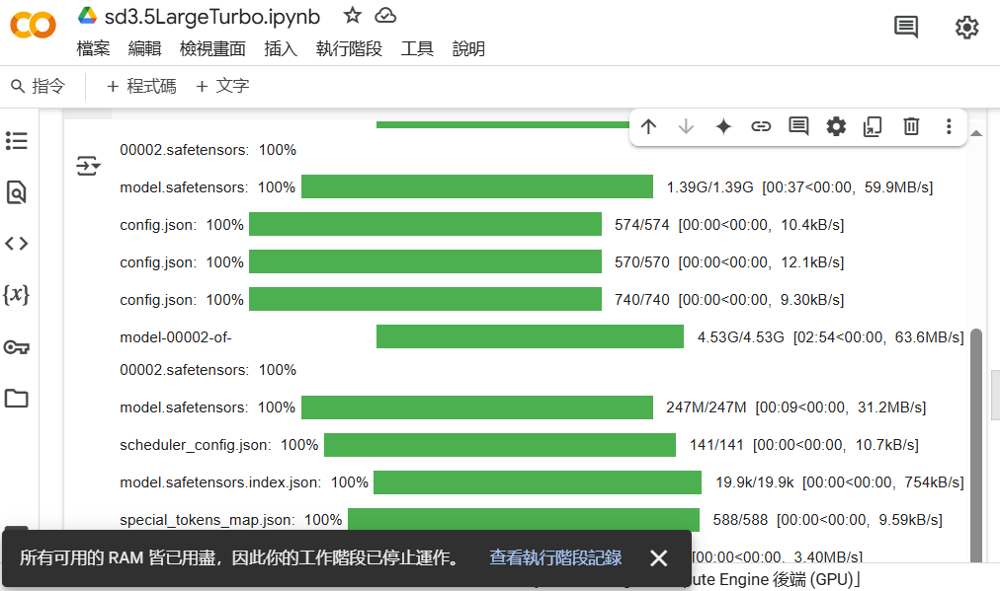
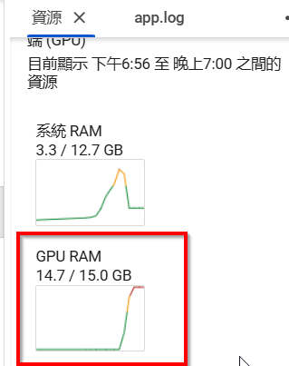
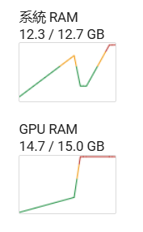
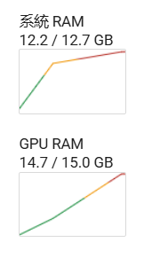

想跑看看 satble diffusion 3.5 Large Turbo效果如何，

於是在 Colab 測試一下，沒有想到在 Colab 根本跑不出來。

會遇到兩種情形 :

1.都還沒到 GPU就掛了 ，說記憶體耗盡
2.到 GPU 就直接爆了 ，可是Colab 上的T4有15G的 VRAM啊，這也跑不出來?

總之，RAM & VRAM會一路狂飆然後就GG了。。。 

[Colab 的 notebook 在此](https://colab.research.google.com/drive/1WvjIEbIoI3GUiQQGda9aJwIseEFOVVAq?usp=sharing)，如果你也想試試看的話。
