#### prompt engineering 以 Flux 文字生圖片為例，先直接看結果

第一個提示詞 :
The hypersonic missile broke through the sound barrier and created an air circle, shocking!

第二個提示詞 ：技術細節強化版
A highly detailed, ultra-realistic scene featuring a state-of-the-art hypersonic missile streaking across the sky. The missile dramatically shatters the sound barrier, sending out a brilliant, sharply defined shockwave that forms an expanding air vortex with vivid blue and white contrasts.emphasizing the engineering marvel and explosive dynamic of the moment.

* **細節層面：** 強調“ultra-realistic”、“highly detailed”及“precise engineering”，讓模型關注機身細節、氣流效果、金屬質感等技術要點。
* **顏色與光影：** 指定了鮮明的藍白對比，突出 shockwave 的邊緣清晰度。
* **風格定位：** 偏向科學技術、工業感極強，適合展示產品設計或工程質感

結果:

第三個提示詞 :戲劇氣氛營造版
In a breathtaking cinematic moment, a futuristic hypersonic missile rockets through a stormy twilight sky. Its passage breaks the sound barrier with an explosion of light and energy, leaving behind a mesmerizing, swirling ring of turbulent air mixed with ethereal hues of purple and orange. The scene exudes intense drama and awe, as if capturing a moment of pure, shocking power and futuristic wonder.

* **情感與氣氛：** 以“breathtaking cinematic moment”、“intense drama”、“awe”來塑造戲劇性及視覺震撼效果。
* **色彩描述：** 運用“purple and orange”、“stormy twilight sky”等表達，強調氛圍和情感色調，使圖像更偏藝術、抽象。
* **視覺層次：** 著重整個畫面的光影、能量爆發和動態氣流，呈現出一種流動且夢幻的視覺效果。

結果:

其實目前的 prompt engineering，已經進化到工程地步了，甚至開發專案在用的CI/CD都拿來用了，但我自己也不是專家、也不熟，就不廢話了，免得被噴太慘。

#### 以下是本次範例的詳細實施步驟，有興趣的路人可以自己嘗試 。

我們將需要以下東西:

1.ComfyUI

2.Flux1.0 模型

3.clip模型

4.VAE 模型

### Why ComfyUI ?

ComfyUI 能在硬體資源受限的設備上仍能運行大型 AI 模型（例如擴散模型），主要是因為它在設計和執行流程上採用了多項優化技術，從而大幅降低了所需的 GPU 記憶體和運算負荷，對於硬體可能受限又想要評估大型模型結果，非常有幫助。

這次適用本身環境，把大量資料放在d槽大空間，避免把C槽塞爆了，採用 windows portable 版本，

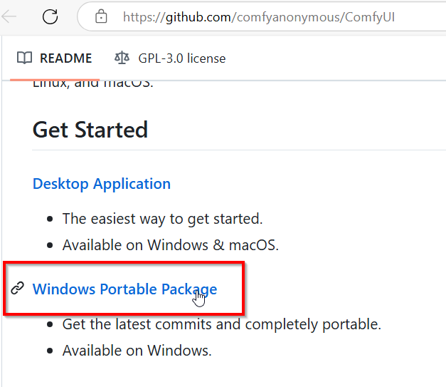

解壓後直接可用，執行 run_nvidia_gpu.bat即可，如果有問題則到update資料夾，執行 update。

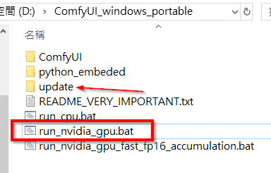

看到以下畫面

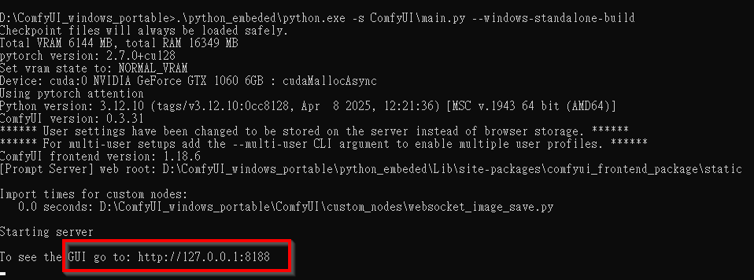

表示成功執行，沒有問題， 這時開啟瀏覽器到  http://127.0.0.1:8188 ，就能看見熟悉的 ComfyUI 介面了。

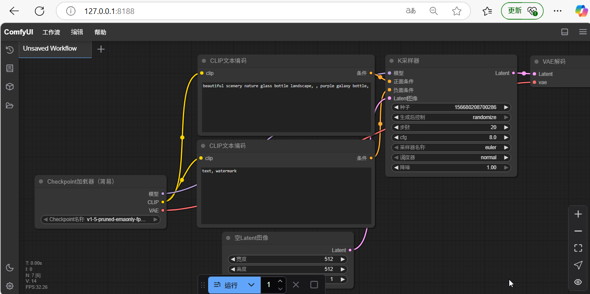

my 廢話 about ComfyUI :

1. **節點化工作流程與局部重算**
   ComfyUI 採用圖形化的節點管理系統，將整個模型的執行過程拆分成多個小節點（或模塊）。這種方式可以讓系統只對那些在當次運行流程中發生改變的部分進行重新計算，而不必每次都從頭執行整個模型。這樣一來，即使硬件資源較低，只要大部分計算結果能夠重用，也能大幅降低內存和運算要求。
2. **智能內存管理**
   ComfyUI 內建了智能的內存管理與緩存技術，可以根據需要動態卸載或復用中間結果，從而減少 GPU VRAM 的占用。據其介紹，ComfyUI 能夠在只有約 1GB VRAM 的 GPU 上運行（當然在性能上可能會有所折衷），這意味著它採用了很強的內存優化策略，使得低端設備也有機會跑出結果。
3. **分步執行與延遲計算**
   通常，傳統的執行方式一次性將整個模型喂入 GPU 運行，這會導致記憶體需求暴增。而 ComfyUI 的分步執行允許系統“按需”執行各個步驟，將整個工作流程分解，從而在每一步只保留必要的計算結果，降低了瞬間內存占用峰值。這一策略使得即使在硬體不足的情況下，也能逐步完成圖像生成。
4. **精度與數據格式優化**
   為了進一步降低資源消耗，ComfyUI 支援使用低精度運算（如 FP16 或 bfloat16）。採用低精度模式不僅可以減少數據占用的記憶體空間，還能加速推理過程。這種優化方式通常在不影響最終輸出質量的情況下，有效降低了硬體門檻。

總結來說，ComfyUI 能夠在硬體條件不足時仍然跑出 AI 模型結果，得益於它的模組化節點化流程、智能內存管理和分步計算機制，再配合低精度數據運算的使用，使得整個流程在資源需求上得到了極大優化。這些技術共同作用，不僅降低了記憶體消耗，也使得低配置設備得以運行通常需要較高資源的大型 AI 模型，從而為用戶在預算或硬體條件有限的情況下提供了一個可行的解決方案。

這時候可看到 ComfyUI 裡面，還沒有模型

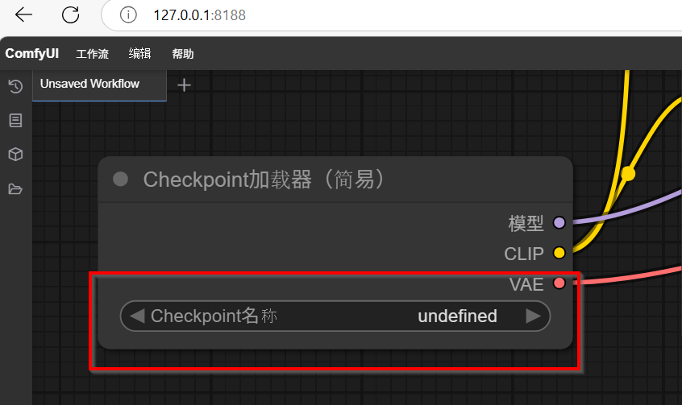

### 接下來準備要用的模型 : Flux1.0

前往 flux的 hugging face
[FLUX.1 - a black-forest-labs Collection](https://huggingface.co/collections/black-forest-labs/flux1-679d013aee236841c0e9d38a)

可以看到有一堆模型，該用哪個呢?

### FLUX.1 系列各變體比較概覽 (這copilot生成的，感覺不完全對)

| **變體名稱**              | **用途/主要特性**                                                                                             | **推薦應用場景**                                               | **估計顯卡內存要求 (VRAM)** | **備註**                                                                                      |
| --------------------------- | --------------------------------------------------------------------------------------------------------------- | ---------------------------------------------------------------- | ----------------------------- | ----------------------------------------------------------------------------------------------- |
| **FLUX.1-dev**            | 基線版開發模型，追求質量與速度之間的平衡，適合一般文本到圖像生成。                                            | 研究、實驗和一般非商業項目                                     | 約 6–8 GB                  | 基礎版本；適用於探索與一般應用，生成效果穩定，屬於“標準品質”範疇。                          |
| **FLUX.1-schnell**        | 強調速度與效率，模型架構經過簡化優化，生成速度更快，權限上通常採用 Apache 2.0。                               | 個人項目、快速原型、局部開發測試                               | 約 4–6 GB                  | 速度優先，細節可能略有折衷；適合開發者實時測試和實驗。                                        |
| **FLUX.1-Fill-dev**       | 專注於 inpainting/infill 任務，能夠讓圖像中缺失部分自然融合，並與周邊風格一致。                               | 圖像修復、填充、改造任務                                       | 約 8 GB                     | 專為需填充區域生成而微調，保證邊緣和紋理的連續一致性。                                        |
| **FLUX.1-Redux-dev**      | 優化版（Redux）變體，通過模型壓縮與架構改動，降低運算需求，同時保持基本生成質量。                             | 快速原型與資源受限的環境                                       | 約 4–6 GB                  | 截取部分參數以降低計算負擔，適合在中低配硬體上快速生成預覽效果。                              |
| **FLUX.1-Depth-dev**      | 使用深度圖作為輔助條件，提升圖像的三維感與結構層次，能夠帶來更明顯的空間和形狀特徵。                          | 須強調結構與立體感的應用（如產品設計、建築概念、影片概念設計） | 約 8–10 GB                 | 需要同時處理文本與深度信息，因此通常對顯存要求較高；生成圖像在光影與結構上表現更精細。        |
| **FLUX.1-Canny-dev**      | 基於 Canny 邊緣檢測結果作為條件輸入，著重圖像邊緣和輪廓的清晰度，適合需要線條和設計稿風格的輸出。             | 概念設計、技術草圖或需要突出線條與邊緣結構的視覺作品           | 約 8–10 GB                 | 通過引入邊緣細節，能夠提高生成圖像在輪廓、筆觸和工業設計語言上的表現；通常和 Depth-dev 類似。 |
| **FLUX.1-Depth-dev-lora** | 基於 Depth-dev 的 LoRA 版本，利用低秩適應（LoRA）技術輕量化專門針對深度條件模型，進行風格或細節的微調與定制。 | 對圖像 3D 結構有要求且希望根據用戶風格進行個性化調整的項目     | 約 6–8 GB                  | 利用 LoRA 減少參數量，可在保持較高品質的同時降低顯存占用，適合定制化應用。                    |
| **FLUX.1-Canny-dev-lora** | 基於 Canny-dev 的 LoRA 版本，針對邊緣與線條條件進行輕量化調整，方便用戶快速定制圖像輪廓及視覺風格。           | 個性化藝術創作、需要自定義線條及結構調整的應用                 | 約 6–8 GB                  | LoRA 技術使得模型在設備資源有限的情況下依然能達到高品質；靈活性較高，更便於風格調整。         |

其實點進去每個模就會看到該模型的說明或用途，看原版的說明，應該還是比較準的。

因為只是要練習、比較 prompt engineering ，選一個跑得快的， scnell 版 .

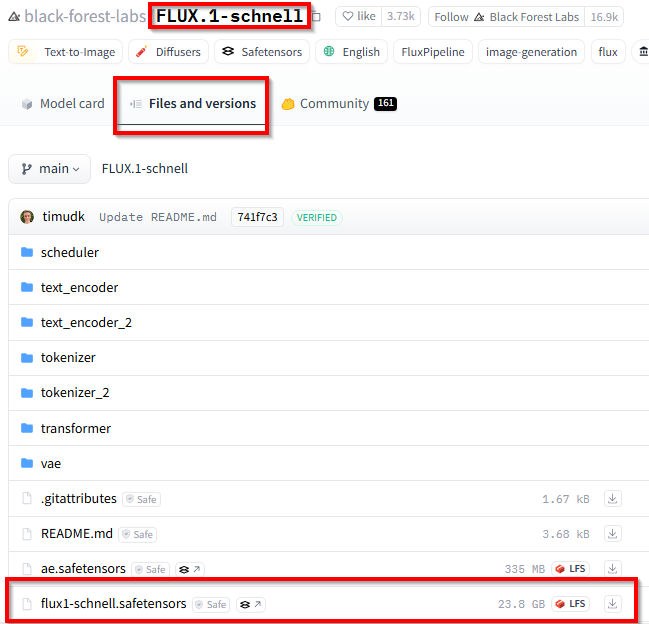

下載下來，放在 ComfyUI_windows_portable\ComfyUI\models\unet 之下。

接著，我們需要 clip 模型 ，到
[comfyanonymous/flux_text_encoders at main](https://huggingface.co/comfyanonymous/flux_text_encoders/tree/main)

紅框是我們需要的東西

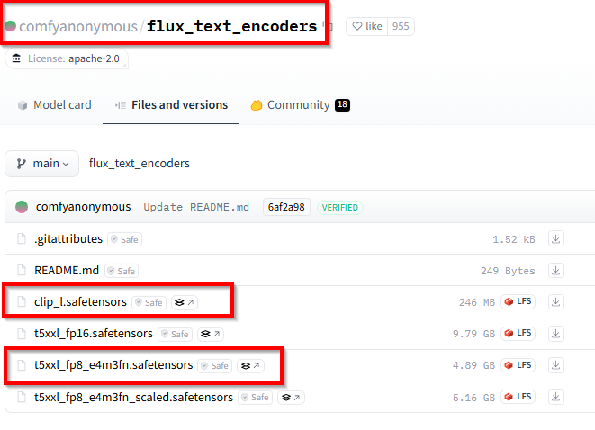

這兩個模型下載到 D:\ComfyUI_windows_portable\ComfyUI\models\clip

再來是 VAE模型，在剛才 schnell 那裡

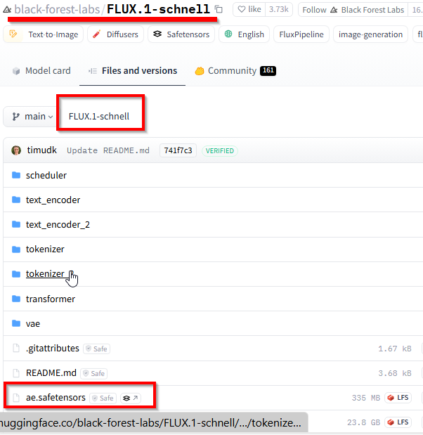

把這個 ae.safetensors 下載到 ComfyUI_windows_portable\ComfyUI\models\vae

此時都準備好了，假如剛才有打開 server 的話，先 ctrl+c 關掉。 重新執行 run_nvidia_gpu.bat

然後瀏覽器去該網址

現在需要 把 flux工作流拉進ComfyUI，工作流在哪? 去 ComfyUI-example 找flux的

[ComfyUI_examples/flux at master · comfyanonymous/ComfyUI_examples](https://github.com/comfyanonymous/ComfyUI_examples/tree/master/flux)

我們用的是 schnell ，頁面上找到 schnell 的 example

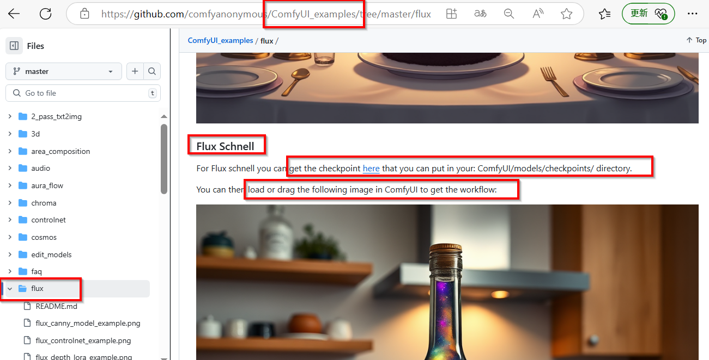

所以，那張圖就是 workflow了 ，參數已經在裡面。 把這張圖下載回來，拖進去ComfyUI 介面裡面，即可看見 自動設定好的各個參數。

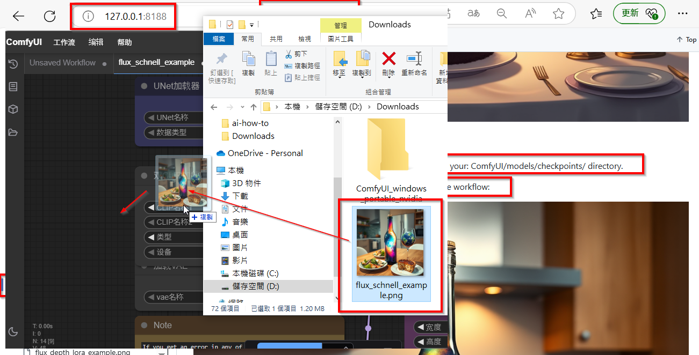

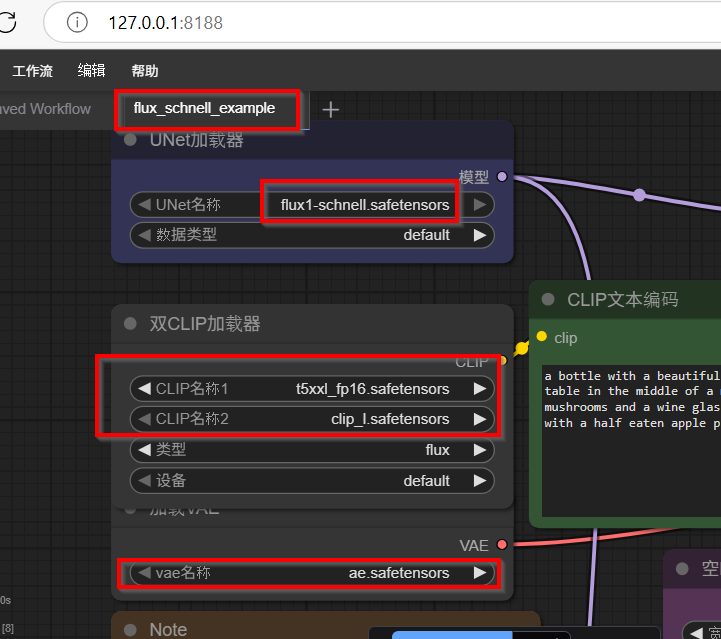

我們剛才放進去的模型，都出現在這個工作流裡面了，**不過CLIP名稱1那裏要改成我們使用的 fp8版本**。

這時候可以開始玩了， 修改 prompt 看跑出來的結果有何不同，結果在本文最上方。
