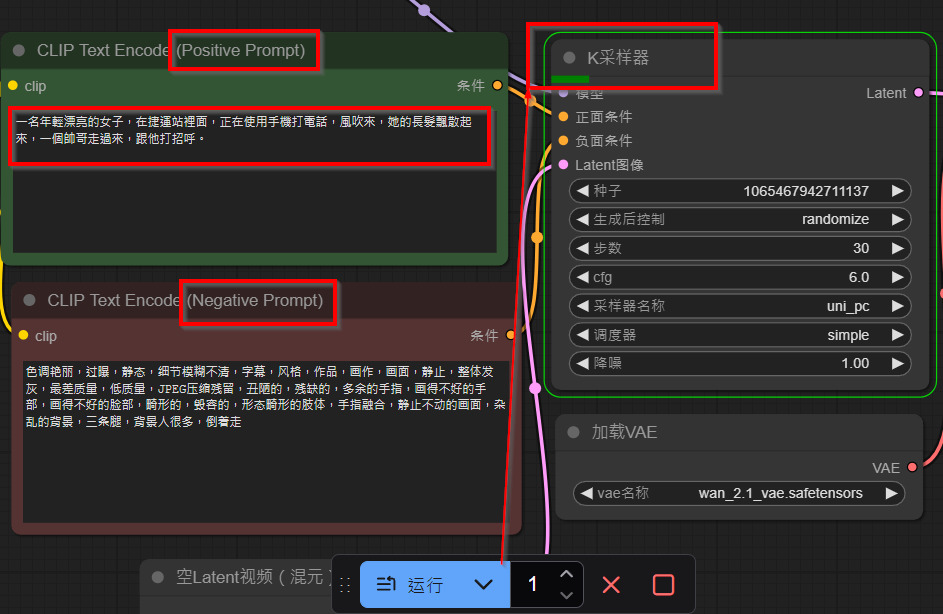

wan2.1 是實測過，真正能在 GTX1060 ti  6GB VRAM 完成 文字產生視頻的模型，使用者評價都很高，甚至超過一些商用模型例如 sora。

按照 [說明 ](https://https://www.freedidi.com/18705.html) 可以在幾分鐘內開始使用測試。

注意此範例用 ComfyUI。

在 clip text encode 那邊輸入你要的影片描述，按下 運行 ，等一下就會看見 K採樣器開始動了。

