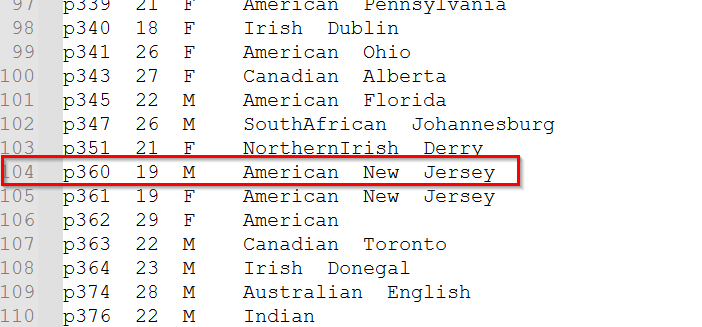

### CoquiTTS

https://docs.coqui.ai/en/latest/docker_images.html

https://github.com/coqui-ai/TTS/

### docker 跑起來 :

(注意 -v 掛載模型目錄 & 輸出目錄)

$docker run --rm -it --gpus all `-v d:/MyModels/TTSModels:/root/.local/share/tts/`
-v d:/MyTTSOutputs:/app/output/ `--entrypoint /bin/bash`
ghcr.io/coqui-ai/tts

在Docker中啟動 server.py 如果沒有指定模型，會自動下載預設 tts_models/en/ljspeech/tacotron2-DDC。

所以呢，基本上 跑一個 coquiTTS Docker 起來，只能跑一種模型。

### Docker 運行 tts_models/en/vctk/vits 模型並 isten

那舉例我們現在要找一個英文、美國、男生的聲音，那我們使用 tts_models/en/vctk/vits 模型，我們會這樣跑:
$
docker run --rm -it --gpus all ` -v d:/MyModels/TTSModels:/root/.local/share/tts/`
-v d:/MyTTSOutputs:/app/output/`--entrypoint /bin/bash`-p 5002:5002`ghcr.io/coqui-ai/tts`
-c "python3 TTS/server/server.py --model_name tts_models/en/vctk/vits --use_cuda true --port 5002"

(watch out blank behind ` if you are in powershell)

這樣，一個  tts_models/en/vctk/vits 模型就運作在 port 5002 。

### 發出 request 指定文字&想要的聲音

然後，我們想要 一個美國男性，唸出 "Taiwan is Nember one ! " ，那我們就要對 URL 發出 這樣的 request :
http://localhost:5002/api/tts?text=Taiwan is Nember one !&speaker_id=p360，這樣 coquiTTS就會傳回 audio 檔了(if there is no error)。

從 vctk_speaker-info.txt 裡面，我們能找到

就這樣用測試的，先找出你要的聲音。

p255、p341、p360: 女生

p340、p258、p262: 男生

其他

coquiTTS docker 內，命令列 列出支援模型 :
$python3 TTS/server/server.py --list_models #To get the list of available models

中文模型(1 speaker)

model_name=tts_models/en/vctk/vits

docker 內，命令列 列出模型內 speaker:

$tts --model_name tts_models/en/vctk/vits --list_speaker_idxs true

(這也可以驗證模型的 speaker 是否多位，如果是單一 speaker ，執行上述命令會 response : AttributeError: 'NoneType' object has no attribute 'name_to_id'，就表示這個模型只有一個 speaker )

英文模型 (multi speakers)

VCTK (Voice Cloning Toolkit) 資料集本身就包含了 109 位英語語者，語言、地區、性別。 見 vctk_speaker-info.txt 。
