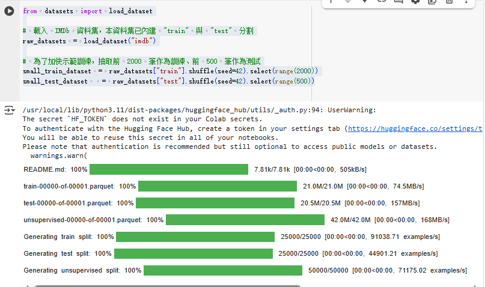
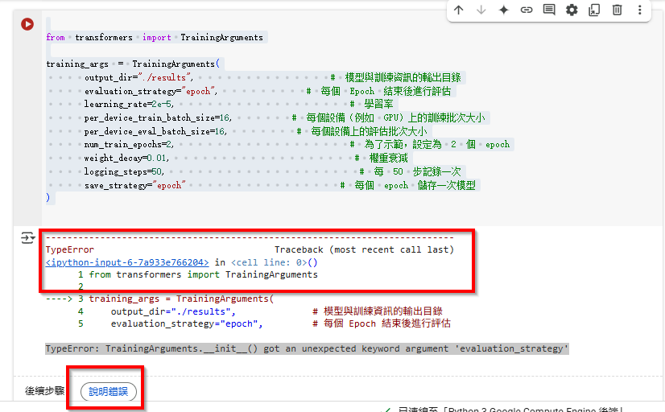
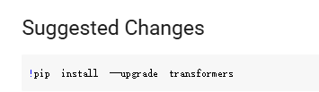
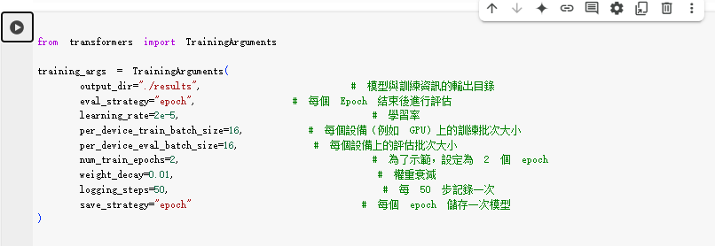
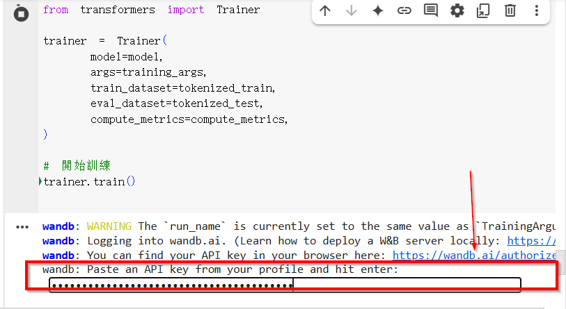
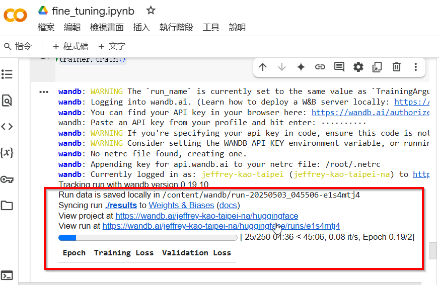
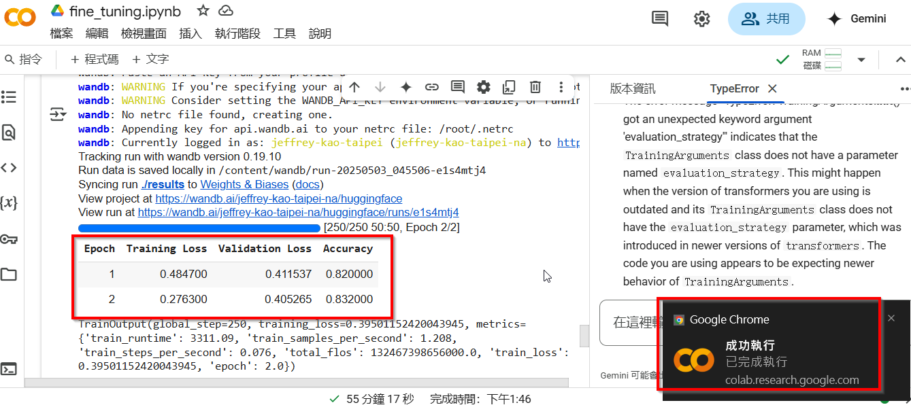

用 Colab 跟 Hagging Face 來 fine tuning 模型。
這個主題比較枯燥，一般使用者也不需要知道這些細節。fine tuning 常跟RAG 拿來比對討論，簡單來說，fine tuning 會改變模型的本身，對於指定的 dataset 會有更佳的表現，RAG則不會改變 模型的本身，而是透過外加的 knowladge 強化某方面的知識。資料的準備上也有不同， fine-tuning通常要提供符合規格的 dataset format， RAG則不需要。
以下是一個簡單的 使用CoLab 做 fine-tuning 實做案例。

* **安裝必要套件**
  使用 `pip install transformers datasets`。
* **登入 Hugging Face Hub**
  使用 `notebook_login()` 完成 API token 認證。
* **載入 IMDb 數據集**
  並抽取子集以便快速實驗。
* **初始化預訓練 Tokenizer 與模型**
  這裡選用 DistilBERT，並設定為二分類任務。
* **數據預處理（Tokenize）**
  使用 map 函數進行批次預處理。
* **設定訓練參數與建立 Trainer**
  定義超參數、為訓練與評估準備好環境。
* **開始訓練、評估模型**
  透過 Trainer.train() 進行微調，之後執行評估與儲存模型。

`!pip install --upgrade transformers datasets`

通常在這一步會出現一堆 package version conflict ，但通常 CoLab已經處理好了，重新執行這個 cell 就會發現錯誤訊息不見了。

`!from datasets import load_dataset`

載入 IMDb 資料集，**本資料集已內建 "train" 與 "test" 分割**

raw_datasets = load_dataset("imdb")

為了加快示範訓練，**抽取前 2000 筆作為訓練、前 500 筆作為測試**

`small_train_dataset = raw_datasets["train"].shuffle(seed=42).select(range(2000)) small_test_dataset  = raw_datasets["test"].shuffle(seed=42).select(range(500))`

可以看到，很快就做完了。

使用 DistilBERT 模型（預訓練版本），並設定為序列分類任務，因為 IMDb 是二分類的情感分析問題（Positive/Negative）

`from transformers import AutoTokenizer, AutoModelForSequenceClassificationmodel_checkpoint = "distilbert-base-uncased"`

初始化 Tokenizer：負責將原始文字轉換成模型輸入需要的 ID 序列

`tokenizer = AutoTokenizer.from_pretrained(model_checkpoint)`

載入模型：調整模型以適用於兩個分類（正面與負面）

`model = AutoModelForSequenceClassification.from_pretrained(model_checkpoint, num_labels=2)`

使用 Hugging Face 的 TrainingArguments 定義訓練時的超參數配置。這裡設定每個訓練 batch 大小、學習率、訓練 epoch 數等。

`from transformers import TrainingArgumentstraining_args = TrainingArguments( output_dir="./results",              # 模型與訓練資訊的輸出目錄 evaluation_strategy="epoch",         # 每個 Epoch 結束後進行評估 learning_rate=2e-5,                  # 學習率 per_device_train_batch_size=16,      # 每個設備（例如 GPU）上的訓練批次大小 per_device_eval_batch_size=16,       # 每個設備上的評估批次大小 num_train_epochs=2,                  # 為了示範，設定為 2 個 epoch weight_decay=0.01,                   # 權重衰減 logging_steps=50,                    # 每 50 步記錄一次 save_strategy="epoch"                # 每個 epoch 儲存一次模型 )`

以上 cell 執行會出現錯誤

Colab很貼心 ，按下 錯誤說明 看看建議。

因此，

`!pip install --upgrade transformers !pip show transformers`
在上面多加上一個 cell，先執行 update 再往下跑。結果還是一樣。
問了 CoPilot ，把 evaluation_strategy 換成 eval_strategy ，然後執行，就好了。

`import numpy as np `

`from datasets import load_metric`

載入準確率衡量工具（Hugging Face metric）

`accuracy_metric = load_metric("accuracy")`

`def compute_metrics(eval_pred):`
`logits, labels = eval_pred`
`predictions = np.argmax(logits, axis=-1)`
`return accuracy_metric.compute(predictions=predictions, references=labels)`

這裡又報錯，
`ImportError: cannot import name 'load_metric' from 'datasets'`

新版的 Huggin Face 用 Evaluate 套件計算 accuracy 指標，先安裝
`!pip install evaluate`

然後 ，程式碼換成以下使用 evalute

`import numpy as np`
`import evaluate`

`accuracy_metric = evaluate.load("accuracy")`

`def compute_metrics(eval_pred):`
`logits, labels = eval_pred`
`predictions = np.argmax(logits, axis=-1)`
`return accuracy_metric.compute(predictions=predictions, references=labels)`

利用 Trainer 將模型、資料與訓練參數組合起來，然後開始訓練。

`from transformers import Trainer`

`trainer = Trainer( model=model, args=training_args, train_dataset=tokenized_train, eval_dataset=tokenized_test, compute_metrics=compute_metrics, )`

開始訓練

`trainer.train()`

這裡會遇到 wandb ，

去 那個 authorize 網址取得 API key 貼上就可以了 。
然後就看到開始在跑 training了。

這是一個漫長的過程，就等他跑完吧。

成功地完成了 fine-tuning .
