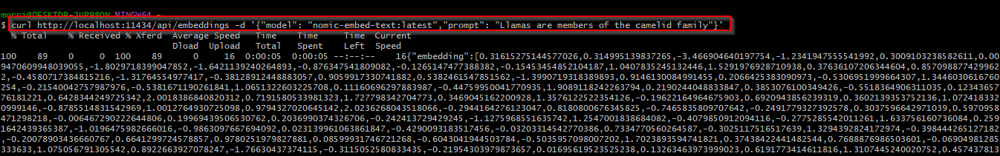
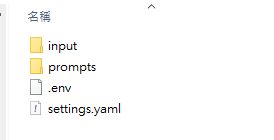
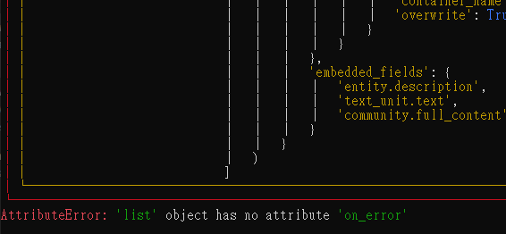

check basic  for ollama & litellm basic.

with ollama , we use one LLM model (cwchang/llama-3-taiwan-8b-instruct:latest), and one embedding model(nomic-embed-text:latest) to wok with GraphRag .

1. prepare embedding model ， ex:nomic-embed-text

`$ollama pull nomic-embed-text`

check if model exist

`$ollama list`

embedding model don't need to run , just access via api，

Ex: curl http://localhost:11434/api/embeddings -d '{"model": "nomic-embed-text:latest","prompt": "Llamas are members of the camelid family"}'

(curl in windows terminal not working, use git bash instead)

2. LLM

`$ollama run cwchang/llama-3-taiwan-8b-instruct:latest`

llama-3-taiwan-8b-instruct:latest 是基於繁體中文的大型模型語言

`curl http://localhost:11434/v1/chat/complete -H "Content-Type: application/json" -d '{ "model": "cwchang/llama-3-taiwan-8b-instruct:latest", "messages": [ { "role": "system", "content": "你是個有用的助手." }, { "role": "user", "content": "你好啊!" } ] }'`

use conda env 'autogen_litellm' previously established .

`$conda activate autogen_litellm `

install GraphRAG

`$pip install graphrag`

create a folder forrag indexer

`$mkdir -p ./rag_graph/input`

input 就是要放資料(文件)的地方 。

`graphrag init --root  ./rag_graph`

rag indexer 會將 rag_graph/inpu folder 裡的東西 進行 初始化 .並產生 .env、settings.yaml檔案。

設定檔 setting.yaml

執行 indexing

`graphrag index --root rag_graph`

### trouble shooting

garphrag index  error while    create_base_entity_graph AttributeError: 'list' object has no attribute 'on_error'

以上錯誤，可以經由 upgrade graphrag 版本解決

查看目前 graphrag版本 : `$pip pip show graphrag`
升級 graphrag : `$pip install --upgrade graphrag`
