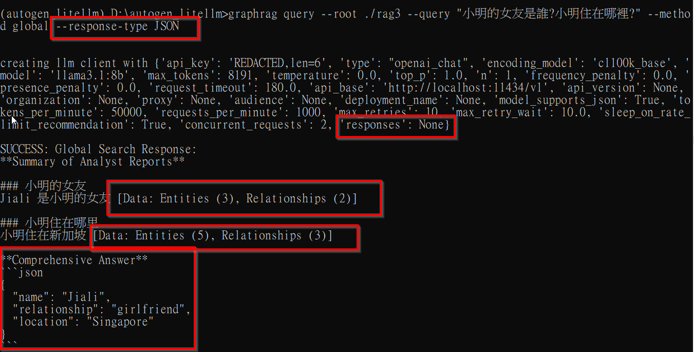

## GraphRag 環境

with ollama , we use one LLM model (llama3.1:8b), and one embedding model(nomic-embed-text:latest) to wok with GraphRag .

1. prepare embedding model ， ex:nomic-embed-text

`$ollama pull nomic-embed-text`

check if model exist

`$ollama list`

embedding model don't need to run , just access via api，

Ex: curl http://localhost:11434/api/embeddings -d '{"model": "nomic-embed-text:latest","prompt": "Llamas are members of the camelid family"}'

(curl in windows terminal not working, use git bash instead)

2. LLM

`$ollama run cwchang/llama-3-taiwan-8b-instruct:latest`

llama-3-taiwan-8b-instruct:latest 是基於繁體中文的大型模型語言

`curl http://localhost:11434/v1/chat/complete -H "Content-Type: application/json" -d '{ "model": "cwchang/llama-3-taiwan-8b-instruct:latest", "messages": [ { "role": "system", "content": "你是個有用的助手." }, { "role": "user", "content": "你好啊!" } ] }'`

if ollama version > 0.5 , use below api end point :

`$ curl http://localhost:11434/api/chat -d '{ "model": "cwchang/llama-3-taiwan-8b-instruct:latest", "messages": [ { "role": "user", "content": "why is the sky blue?" } ] }'`

*all end points check ollama doc :  [https://github.com/ollama/ollama/blob/main/docs/api.md](https://https://github.com/ollama/ollama/blob/main/docs/api.md)

use conda env 'autogen_litellm' previously established .

`$conda activate autogen_litellm `

install GraphRAG

`$pip install graphrag`

create a folder forrag indexer

`$mkdir -p ./rag1/input`

input 就是要放資料(文件)的地方 。

`graphrag init --root  ./rag1`

rag indexer 會將 rag1/input folder 裡的東西 進行 初始化 .並產生 .env、settings.yaml檔案。

## 設定檔 settings.yaml

幾個重點 :

1. api_base : LLM 跟 embedding 的api_base都設定在 http://localhost:114334/v1 (很多網路文檔都說 embedding 的end point 在 http://localhost:11434/api ，但其實不行，看以下 triuble shooting 說明 )
2. LLM model 要選 max_tokens >= 8192為佳，ex: llama3.1:8b ，設定 max_tokens : 8191
3. concurrent_requests 設小一點，例如 1 , 2

   working example of settings.yaml 參考本目錄下 settings.yaml。

## 執行 indexing

`graphrag index --root rag1 --config rag1/settings.yaml`

better assign --config setting.yaml path here .

(log file location : D:\autogen_litellm\rag1\logs\)

indexing時相關問題，看 trouble shooting。

#### 接下來驗證，依據不同目錄下，indexing/embedding/graphing 結果，回答不同答案。

建立3個 rag root目錄，rag1 , rag2 ,rag3 ，3個 input folrder內分別放入對應的內容如下

1.小明的女友是阿珠，小明住在台北。

2.小明的女友是Mandy，小明住在加州。

3.小明的女友是佳麗，小明住在新加坡。

對3個目錄進行 init 跟 indexing 後進行提問。

`$graphrag query --root ./rag1 --query "小明的女友是誰?小明住在哪裡?" --method global`

`$graphrag query --root ./rag2 --query "小明的女友是誰?小明住在哪裡?" --method global`

graphrag query --root ./rag3 --query "小明的女友是誰?小明住在哪裡?" --method global

以上，可以得知，雖然答案不完美，但 graphrag 針對相同的問題，的確能從不同root 目錄，回答出各別正確的答案。

#### 接下來，如何讓 graphrag 處理多種格式的檔案 in input folder?

#### 讓 GraphRag讀取網站內容來 indexing

#### GraphRag 的 api/interface ?

#### 擷取 GraphRag的有用部分，當成答案

如果在 query 時指定回應格式， ex: $graphrag query --root ./rag3 --query "小明的女友是誰?小明住在哪裡?" --method global --response-type JSON

則除了 stdout 以外，可看到 簡短的 JSON格式回應

#### 如何cache 問答紀錄，讓 GraphRag 不用每次都去問大模型，以加快速度?

#### 關於三種 method : "local", "global", "drift"

需要進行測試驗證，以決定何種 method 適合甚麼場景使用，ex:智能客服。

#### 進階微調

GraphRag & ollama 的一些參數 ex: concurrent_requests 、 chunl_size ， 或是ollama 的 n_ctx 等等，跟 embedding , indexing 的結果品質、queryt出來品質有關，需要進一步測試驗證。參考 :

[[Ollama][Other] GraphRAG OSS LLM community support · Issue #339 · microsoft/graphrag](https://github.com/microsoft/graphrag/issues/339)

## trouble shooting

1. garphrag index  error while    create_base_entity_graph AttributeError: 'list' object has no attribute 'on_error'
   

以上錯誤，可以經由 upgrade graphrag 版本解決

查看目前 graphrag版本 : `$pip pip show graphrag`
升級 graphrag : `$pip install --upgrade graphrag`

after ollma upgraded to 0.5.11 , run `$graphrag index --root rag_graph`   again , previous error fixed , but encounter error below :

this is all about model , corresponding max_tokens ... and so on , just make settings.yaml correct .

2. ollam embedding problem

   

當 settings.yaml 中 embedding 的 api_base 設定為 http://localhost:11434/api 這個URL ，就會產生以上錯誤。原因是這個api end point 跟 openAI format不相容?
將 settings.yaml中 embedding 的 api_base 改為 LLM的 api_base ，http://localhost:11434/v1 再執行一次 `$graphrag index --root rag1 --config rag1/settings.yaml` 則會出現執行成功的 現象。可是這是對的嗎?

驗證一下

先執行 local query
`graphrag query --root ./rag1 --query "Alice was married to?" --method local`

得到回應

找不到相關的答案。

再執行 global query `$graphrag query --root ./rag1 --query "Alice was married to?" --method global`

1. --method global 有找到答案。
   所以 : 把 settings.yaml 的 embedding api_base 改成 http://localhost:11434/v1 這樣是可行的?
2. 實際上
   `curl http://localhost:11434/v1/embeddings -H "Content-Type: application/json" -d '{ "input": ["hello", "hi"], "model": "bge-m3:latest" }'`
   可以驗證出，v1/embeddings 這個 end point 是存在的，所以在 settings.yaml中，把 embedding 的 api_base 設定在 v1 是可以的，問題是在 從ollama返回的 embedding 結果 not compatible with oenAI format ?
3. 其實在 local query 時，沒有答案，應該就表示 embedding 失敗的?
4. 嘗試把 embedding  模型換成 bge-m3:latest ，再去index ，結果一樣，到底是模型問題還是 ollama 問題?
5. model_supports_json: false ，結果一樣。
6. model_supports_json: true ， 結果一樣。
7. 欲改用 Xinference + embedding ，發現 windows 10無法安裝，因為其中一個套件 autoGPTQ : [windows 10 not support](https://[[BUG] Can&#39;t install with pip on Windows 10 · Issue #767 · AutoGPTQ/AutoGPTQ](https://github.com/AutoGPTQ/AutoGPTQ/issues/767))。
   改到 WSL ubuntu 安裝 Xinference .
   `$pip install "xinference[all]"

   第一次安裝會需要一點時間(也許很多點)，因很多環境都需要下載。
   如果實在太久了(pip resoloving depencies ...) 可以嘗試 :
   `$pip install "xinference[all]" --use-deprecated legacy-resolver`

   最後發現， upgrade pip version 安裝就正常了。(get a version that is newer than 22.0.2, it should work)
   `$pip install --upgrade pip`

*ollama 升級到 0.5.13之後， embedding 似乎就正常了。
