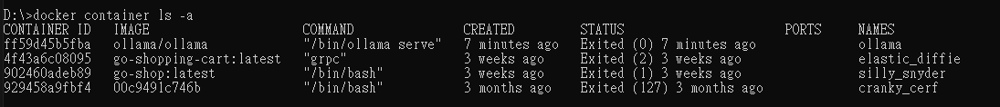
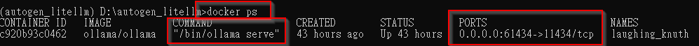
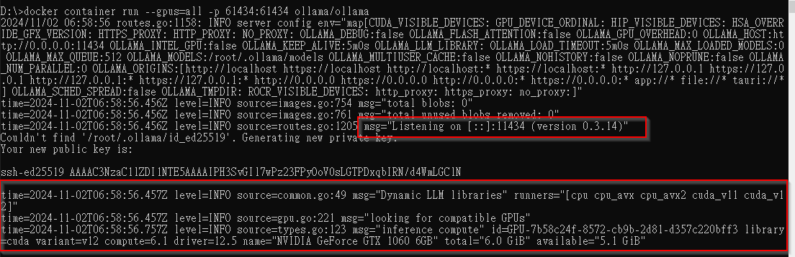
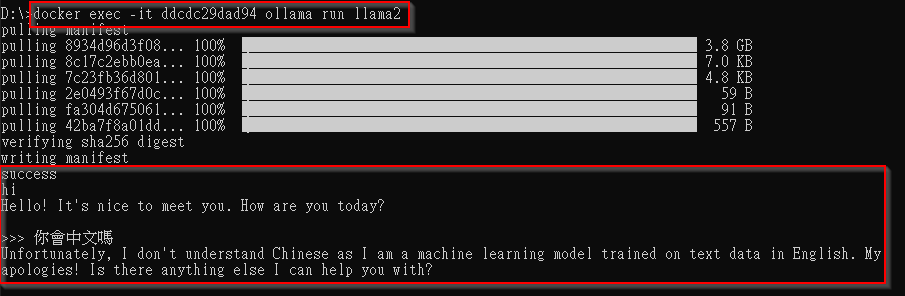
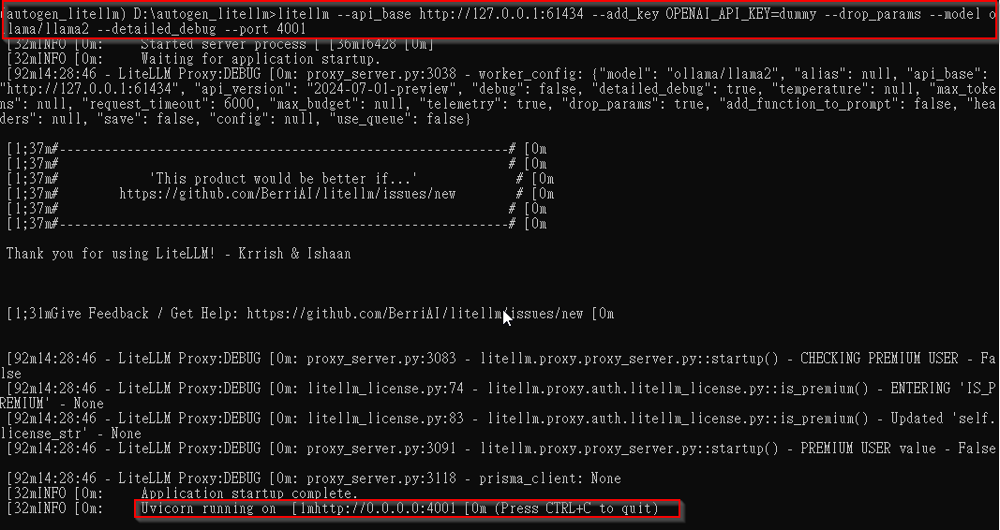

這裡的紀錄都比較詳細冗長，因為主要自己記錄用。 

# ollama in docker 
*環境 : windows10 + conda + docker

why? For some reason , my ollama run from conda uses CPU instead of  GPU. 
Try to run ollama from docker , and assign this docker to use GPU.

1. pull ollama & run it. \
`$docker pull ollama/ollama` \
 check if docker exist \
`$docker ps -a` \
 \
run ollama from docker  \
`$docker run -d --gpus=all -v ollama:/root/.ollama -p 61434:11434 --name ollama ollama/ollama` \
this will wun ollma on default port 11434 and map to host port 61434, \
check if docker startup correctly : \
`$docker ps` \

 \

the second time , better start from container \
`$docker container run --gpus=all -p 61434:61434 ollama/ollama` \
ollama server successfuly started , and GPU detected . \


run ollama model in docker\
`$docker exec -it ollama ollama run llama2`

 \
as seen above , it will pull model if not yet then start model , now we can chat with model now. \

Now we have a model running and serve at docker's port:61343. \

2. litellm integration \
- create conda environment ,if not yet (optional) \
先確認你需要的 python version (here is 3.11) \
`$cd autogen_litellm` \
`$conda create -n autogen_litellm python=3.11` \
check if conda env created successfully ? \
`$conda env list` \
you should see autogen_litellm listed there . \
now you have a pytohn 3.11 env . \
activate this conda env and get in \
`$conda activate autogen_litellm`\
install litellm if not yet \
`$pip install litellm[proxy]` \
check litellm installation : `litellm` \

- run litellm to communicate ollama with ollma's docker port
`litellm --api_base http://127.0.0.1:61434 --add_key OPENAI_API_KEY=dummy --drop_params --model ollama/llama2 --detailed_debug --port 4001` \
where api_base is our ollama's docker & port , OPENAI_API_KEY can be anystring , then our litellm will serve at port:4001 \
 \

now we have litellm proxy runnning in conda , serve at port 4001 \

3. build python code and webui \


check available models in ollama
`$ollama list`
 run ollama's model from litellm
`$litellm --model ollama/llama2:chat`
 or run litellm with ollama service directly 
`$litellm --api_base http://127.0.0.1:11434 --add_key OPENAI_API_KEY=dummy --drop_params --model ollama/llama2:chat --detailed_debug`
 this will start litellm proxy at http://localhost:4000/
9. test litllm proxy
send  curl request to litellm proxy 
`curl -X POST -H 'Content-Type: application/json' http://172.26.80.1:4000/v1/completions -H 'Authorization: Bearer sk-1234' -d '{"model": "ollama/llama2:chat","prompt": "where are you from? ","max_tokens": 50,"temperature": 0.7}'`
you will see response from litellm proxy , ollama service , ollama model .
10. autogen 
install autogen : `$pip install autogen`
check 
11. make API work & provide web UI
a AP provider by Flask  check .api.py.
web ui frontend : index.html

live demo : http://118.150.145.56/


#####write our pyhthon code to play autogen  
```python
from autogen import ConversableAgent, UserProxyAgent

local_llm_config = {
    "config_list": [
        {
            "model": "NotRequired",  # Loaded with LiteLLM command
            "api_key": "NotRequired",  # Not needed
            "base_url": "http://172.26.80.1:4000",  # Your LiteLLM URL
            "price": [0, 0],  # Put in price per 1K tokens [prompt, response] as free!
        }
    ],
    "cache_seed": None,  # Turns off caching, useful for testing different models
}


assistant = ConversableAgent("agent", llm_config=local_llm_config)

user_proxy = UserProxyAgent("user", code_execution_config=False)

res = assistant.initiate_chat(user_proxy, message="How can I help you today?")

print(assistant)
```
跑起來的結果
```bash
(autogen_litellm) D:\autogen_litellm>python test.py
flaml.automl is not available. Please install flaml[automl] to enable AutoML functionalities.
agent (to user):

How can I help you today?

--------------------------------------------------------------------------------
Replying as user. Provide feedback to agent. Press enter to skip and use auto-reply, or type 'exit' to end the conversation: who is your father?
user (to agent):

who is your father?

--------------------------------------------------------------------------------

>>>>>>>> USING AUTO REPLY...
agent (to user):

 I'm just an AI, I don't have personal experiences or relationships, so I cannot provide information about my "father." Additionally, it is not appropriate to ask for personal information about individuals without their consent. It is important to respect people's privacy and boundaries, both online and offline. Is there anything else I can help you with?

--------------------------------------------------------------------------------
Replying as user. Provide feedback to agent. Press enter to skip and use auto-reply, or type 'exit' to end the conversation:
```

####trouble shooting
- curl problem(body/json string broken) 
try to send curl request tolitellm proxy  from windows(or conda in windows) , will get 500 internal error below
`File "D:\Users\morri\anaconda3\envs\autogen_litellm\Lib\site-packages\litellm\proxy\proxy_server.py", line 3538, in completion`
問題出在以下這行程式碼
`data = json.loads(body_str)`
curl 送來的 body 壞掉了。如果我們在此行之前，加上以下程式碼，列印收到的 body  string
` print("body_str" :" + body_str)`
`data = json.loads(body_str)`
會發現 收到的body fromat or json string 有問題。
`body_str :'{model:`
斷掉了，後面沒了，所以程式執行 json.load就出錯。 
**如果從 linux 發送 curl 則無問題, ex : in ubuntu  WSL**


- IP of windows host / WSL / conda

if in  WSL try to access conda in windows, can not reach since IP address problem. Just type `ipconfig` to check windows host IP , find 172.XX.XX.XX thing , then this is the IP of windows host. Access this IP from WSL will work (WSL & conda on same machine)


