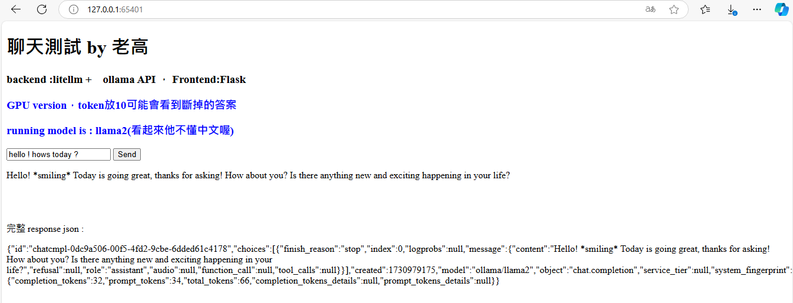
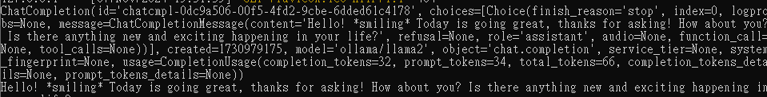
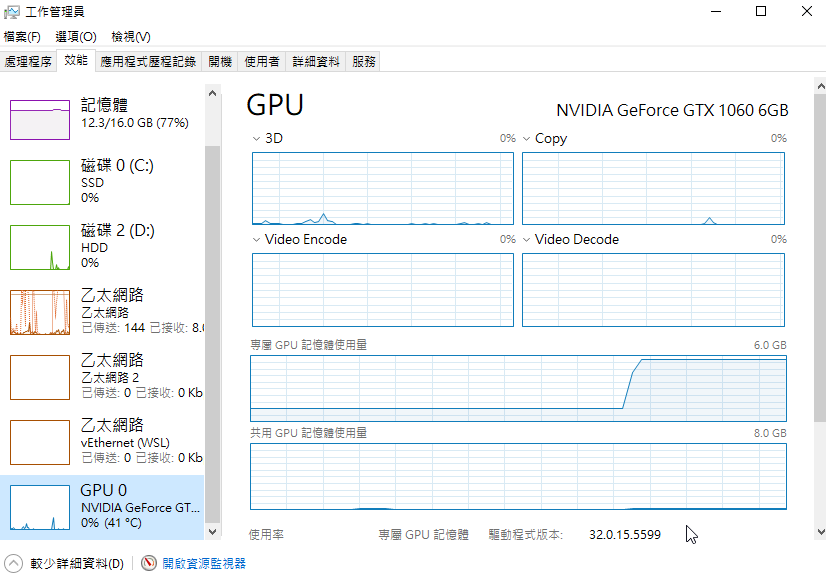

這裡的紀錄都比較詳細冗長，因為主要自己記錄用。

# ollama in docker

*環境 : windows10 + conda + docker

why? For some reason , my ollama run from conda uses CPU instead of  GPU.
Try to run ollama from docker , and assign this docker to use GPU.

1. pull ollama & run it.
   `$docker pull ollama/ollama`
   check if docker exist
   `$docker ps -a`
   
   run ollama from docker
   `$docker run -d --gpus=all -v ollama:/root/.ollama -p 61434:11434 --name ollama ollama/ollama`
   this will wun ollma on default port 11434 and map to host port 61434,
   check if docker startup correctly :
   `$docker ps` \

 \

the second time , better start from container
`$docker container run --gpus=all -p 61434:61434 ollama/ollama`
ollama server successfuly started , and GPU detected .


run ollama model in docker
`$docker exec -it ollama ollama run llama2`


as seen above , it will pull model if not yet then start model , now we can chat with model now. \

Now we have a model running and serve at docker's port:61343. \

2. litellm integration \

- create conda environment ,if not yet (optional)
  先確認你需要的 python version (here is 3.11)
  `$cd autogen_litellm`
  `$conda create -n autogen_litellm python=3.11`
  check if conda env created successfully ?
  `$conda env list`
  you should see autogen_litellm listed there .
  now you have a pytohn 3.11 env .
  activate this conda env and get in
  `$conda activate autogen_litellm`
  install litellm if not yet
  `$pip install litellm[proxy]`
  check litellm installation : `litellm` \
- run litellm to communicate ollama with ollma's docker port
  `litellm --api_base http://127.0.0.1:61434 --add_key OPENAI_API_KEY=dummy --drop_params --model ollama/llama2 --detailed_debug --port 4001`
  where api_base is our ollama's docker & port , OPENAI_API_KEY can be anystring , then our litellm will serve at port:4001
  

now we have litellm proxy runnning in conda , serve at port 4001

3. build python code and webui

- service with python & Flask :

check [to_docker.py]([ai-how-to/ollama_in_docker/to_docker.py at main · jj449/ai-how-to](https://github.com/jj449/ai-how-to/blob/main/ollama_in_docker/to_docker.py)

part of code :

```
from flask import Flask, request, render_template, jsonify
import os
import litellm
import requests
import opena
os.environ["OPENAI_API_KEY"] = "NotRequired"
app = Flask(__name__)`\`LITELLM_PROXY_URL = "http://172.26.80.1:4001"
client = openai.OpenAI(api_key="anything",base_url=LITELLM_PROXY_URL)
```

above set up a basic openAI API service via python & Flask , then get model response as below

```
res = client.chat.completions.create(model="ollama/llama2", messages = [
    {
        "role": "user",
        "content": user_message
    }
])

app.run(host='0.0.0.0', port=65401)


```

now we got a flask service running on port 65401

- frontend ([index_2.html]([templates/index_2.html at main · jj449/ai-how-to](templates/index_2.html)))

(by default , flask's template files are  under templates folder )

access our service by browser , and chat with model



check model process this chat by litellm response


and check GPU usage


we can see GPU usage rise up .

