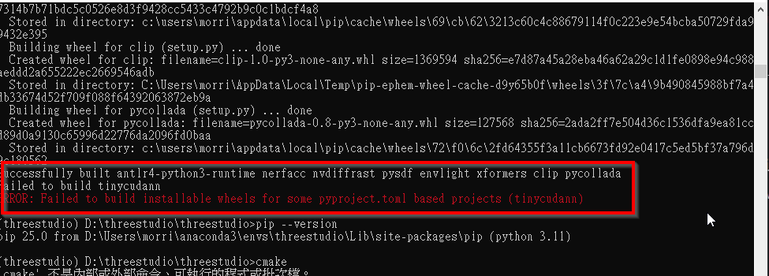
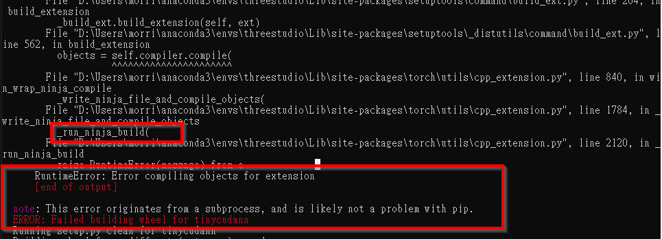
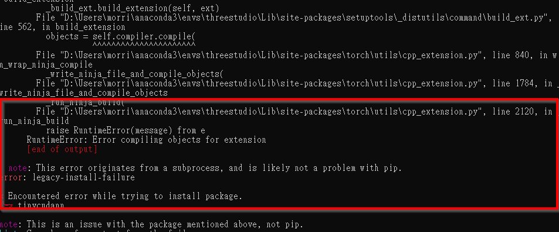

## threestudio (a framework for many 3D、image、video AI model )

### **- installation -**


`$mkdir threestudio`

`$cd threestudio`

`$conda create -n threestudio python=3.11`

`$conda activate threestudio`

`$git clone --recurse-submodules https://github.com/threestudio-project/threestudio.git`

`$cd threestudio`

`$pip install -r requirements.txt`

Basically , follow [steps introduced by threestudio]([threestudio-project/threestudio: A unified framework for 3D content generation.](https://github.com/threestudio-project/threestudio#Installation)) , can finish the installation. But if you are on windows ,you may encounter tiny-cuda-nn building trouble :




if you see this error , then you probably can see anothere errors above (scroll up ) aobut ninja & tiny-cuda-nncuda :





according to theestudio instruction , may need to downgrad pip veriosn :


but after downgrading pip version to 23.0.1 , still not work .



Myabe we need to install/compile tiny-cuda-nn dseperatedly ?
according to[ tiny-cuda-nn official](https://[tiny-cuda-nn/README.md at master · NVlabs/tiny-cuda-nn](https://github.com/NVlabs/tiny-cuda-nn/blob/master/README.md?plain=1#L100C1-L100C1)) , we go the cmake way . Because the installation/compilation must run in windows developer prompt terminal , so we can not do it in conda, so do this directly under windows environment (out of conda) .

from [start]->[visual studio 2022] -> [x64_x86 Cross tools cpmmand prompt] (remember run with admin ) .

then in terminal :

`$git clone --recursive https://github.com/nvlabs/tiny-cuda-nn`

`$cd tiny-cuda-nn `

`tiny-cuda-nn$ cmake . -B build -DCMAKE_BUILD_TYPE=RelWithDebInfo`

`tiny-cuda-nn$ cmake --build build --config RelWithDebInfo -j`

Now , tiny-cuda-nn installed on windows.

run the threestudio install again , same error .

Now try to install a gcc in conda :

`(threestudio) D:\threestudio\threestudio>conda install -c conda-forge gcc=13.2.0`

run threestudio again , failed again. 

Now try to install/compile tiny-cuda-nn in conda with cmake :

`(threestudio) D:\threestudio\threestudio>conda search cmake`

`(threestudio) D:\threestudio\threestudio>conda install -c conda-forge cmake=3.31.5`

Now we had cmake in conda , try run threestudio install again , still same error . 

Now install/compile tiny-cuda-nn seperately ，same steps as installing on windows. 

After install/compile tiny-cuda-nn in conda , hope threestudio can run in conda successfully ， but I found threestudio lack of usage detail(commands) about how to use these  models, decide to turn to [Microsoft Threllis](https://[microsoft/TRELLIS: Official repo for paper &#34;Structured 3D Latents for Scalable and Versatile 3D Generation&#34;.](https://github.com/microsoft/TRELLIS)) .


# Autogen + litellm +ollama

*環境 : windows10 + conda

1. create a folder for this project
   `$mkdir autogen_litellm`
   `$mkdir litellm`
2. get into the folder then create a conda env for this :
   先確認你需要的 python version (here is 3.11)
   `$cd autogen_litellm`
   `$conda create -n autogen_litellm python=3.11`
   check if conda env created successfully ?
   `$conda env list`
   you should see autogen_litellm listed there .
   now you have a pytohn 3.11 env .
3. activate this conda env and get in
   `$conda activate autogen_litellm`
4. install litellm
   `$pip install litellm[proxy]`
   check litellm installation : `litellm`
5. install ollama
   先新增 channel 不然找不到 ollama package
   `$conda config --add channels conda-forge`
   `$conda config --set channel_priority strict`
   then install ollam
   `$conda install ollama`
   check ollama installation : `$ollama --version`
6. start ollama
   `$ollama serv`
   this will make ollama server at default port 11434
   check http://localhost:11434/
7. run/pull model from ollama
   (in activated conda : autogen_litellm)
   `$ollama run llama2:chat `
   this will download&run llama2:chat model
   if model download & run succesfully ,you will see 'Send a message' prompt in terminal , then you can chat with model now.
   (ollama from anaconda chanel is too old to run new model , ex: phi3 , try those models later)
8. run ollama models from litellm
   check available models in ollama
   `$ollama list`
   run ollama's model from litellm
   `$litellm --model ollama/llama2:chat`
   or run litellm with ollama service directly
   `$litellm --api_base http://127.0.0.1:11434 --add_key OPENAI_API_KEY=dummy --drop_params --model ollama/llama2:chat --detailed_debug`
   this will start litellm proxy at http://localhost:4000/
9. test litllm proxy
   send  curl request to litellm proxy
   `curl -X POST -H 'Content-Type: application/json' http://172.26.80.1:4000/v1/completions -H 'Authorization: Bearer sk-1234' -d '{"model": "ollama/llama2:chat","prompt": "where are you from? ","max_tokens": 50,"temperature": 0.7}'`
   you will see response from litellm proxy , ollama service , ollama model .
10. autogen
    install autogen : `$pip install autogen`
    check
11. make API work & provide web UI
    a AP provider by Flask  check .api.py.
    web ui frontend : index.html

live demo : http://118.150.145.56/

#####write our pyhthon code to play autogen

```python
from autogen import ConversableAgent, UserProxyAgent

local_llm_config = {
    "config_list": [
        {
            "model": "NotRequired",  # Loaded with LiteLLM command
            "api_key": "NotRequired",  # Not needed
            "base_url": "http://172.26.80.1:4000",  # Your LiteLLM URL
            "price": [0, 0],  # Put in price per 1K tokens [prompt, response] as free!
        }
    ],
    "cache_seed": None,  # Turns off caching, useful for testing different models
}


assistant = ConversableAgent("agent", llm_config=local_llm_config)

user_proxy = UserProxyAgent("user", code_execution_config=False)

res = assistant.initiate_chat(user_proxy, message="How can I help you today?")

print(assistant)
```

跑起來的結果

```bash
(autogen_litellm) D:\autogen_litellm>python test.py
flaml.automl is not available. Please install flaml[automl] to enable AutoML functionalities.
agent (to user):

How can I help you today?

--------------------------------------------------------------------------------
Replying as user. Provide feedback to agent. Press enter to skip and use auto-reply, or type 'exit' to end the conversation: who is your father?
user (to agent):

who is your father?

--------------------------------------------------------------------------------

>>>>>>>> USING AUTO REPLY...
agent (to user):

 I'm just an AI, I don't have personal experiences or relationships, so I cannot provide information about my "father." Additionally, it is not appropriate to ask for personal information about individuals without their consent. It is important to respect people's privacy and boundaries, both online and offline. Is there anything else I can help you with?

--------------------------------------------------------------------------------
Replying as user. Provide feedback to agent. Press enter to skip and use auto-reply, or type 'exit' to end the conversation:
```

####trouble shooting

- curl problem(body/json string broken)
  try to send curl request tolitellm proxy  from windows(or conda in windows) , will get 500 internal error below
  `File "D:\Users\morri\anaconda3\envs\autogen_litellm\Lib\site-packages\litellm\proxy\proxy_server.py", line 3538, in completion`
  問題出在以下這行程式碼
  `data = json.loads(body_str)`
  curl 送來的 body 壞掉了。如果我們在此行之前，加上以下程式碼，列印收到的 body  string
  ` print("body_str" :" + body_str)`
  `data = json.loads(body_str)`
  會發現 收到的body fromat or json string 有問題。
  `body_str :'{model:`
  斷掉了，後面沒了，所以程式執行 json.load就出錯。
  **如果從 linux 發送 curl 則無問題, ex : in ubuntu  WSL**
- IP of windows host / WSL / conda

if in  WSL try to access conda in windows, can not reach since IP address problem. Just type `ipconfig` to check windows host IP , find 172.XX.XX.XX thing , then this is the IP of windows host. Access this IP from WSL will work (WSL & conda on same machine)
