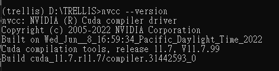
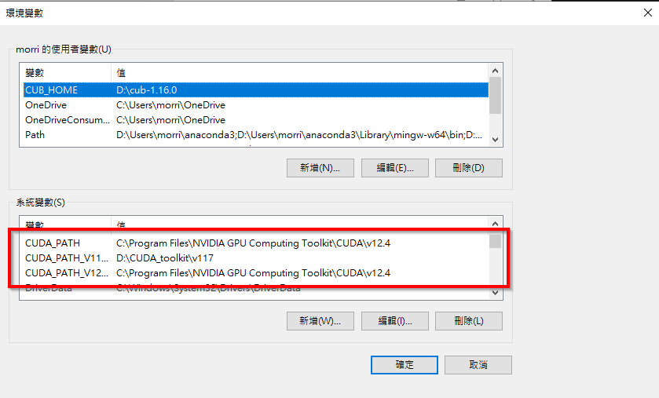
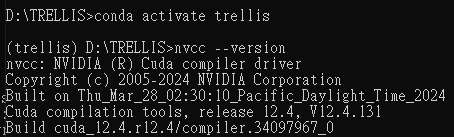
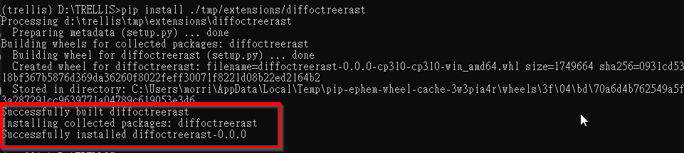
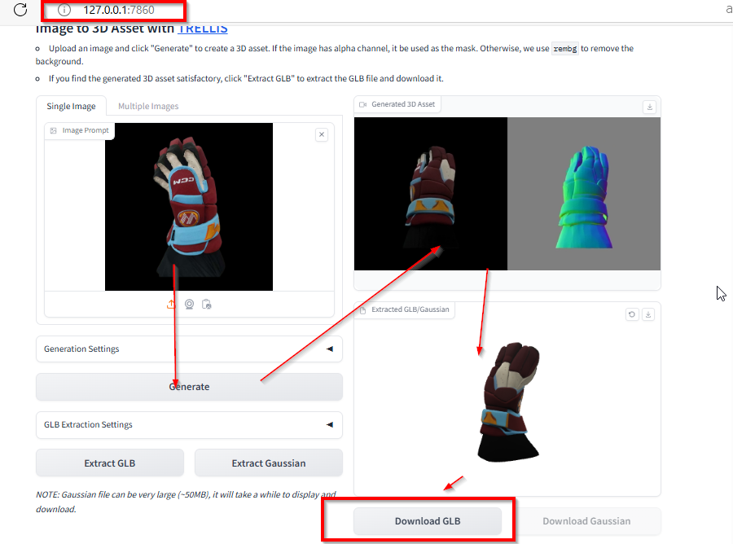
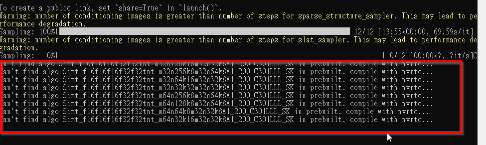

## Trellis install and run

in conda on windows 10 ，according to [this post](https://https://github.com/microsoft/TRELLIS/issues/3#issuecomment-2524713914) on github ，when proocessed till installing diffoctreerast :
`$pip install ./tmp/extensions/diffoctreerast`

encounter  cuda version error : The detected CUDA version (11.7) mismatches the version that was used to compile
PyTorch (12.4). Please make sure to use the same CUDA versions.

check CUDA version in conda :

`$nvcc --version`

it shows current version used in conda is 11.7

install CUDA 12.4 in conda :

`$pip install torch torchvision torchaudio --index-url https://download.pytorch.org/whl/cu124`

then re-install diffoctreerast , still failed. We found in conda env :

`$nvcc --version`

still 11.07 , so this not work in conda. conda still find CUDA path&version in windows system variables.

So , we need to install a CUDA of version 12.4 on windows system not in conda , downalod from nvidia website & install it,
after installation , in windows system path will be changed to 12.4 .

now , **close and re-open terminal(make the variable&path change valid)** ， enter conda env again

`$conda activate trellis`

then check nvcc version again

`$nvcc --version `

now, it's version 12.4

then , continue trellis installation again :

`$pip install ./tmp/extensions/diffoctreerast`

then , in this step
`$cp -r ./extensions/vox2seq ./tmp/extensions/vox2seq`

should be fixed as **use explorer to copy entire vox2seq folder to ./tmp/extensions/**
(since we are in conda on windows system) ，then install it

`$pip install ./tmp/extensions/vox2seq`

After successfully insatlled , start trellis web interface and test :
`(trellis) D:\TRELLIS>python app.py`

encounter error below :

**RuntimeError: FlashAttention only supports Ampere GPUs or newer**

GPU型號太舊，不支援。

**change attn_flash to xformer** :
**$set ATTN_BACKEND=xformers**``

then re-launch trellis to test ，

it works !

But sometimes it will fail because Insufficient Graphics Card Memory (VRAM), 遇此情形 可先關閉 windows  task manager ，不知為何 task manager 會影響 GPU工作，但關閉task manager 後通常可以完成 3D模型產生工作。

可能因為硬體效能的關係(GTX 1060 ti , 6G VRAM)，
從 照片生成 3D模型的過程，需要幾十分鐘 (8張照片為例)。
從 3D模型 產生  GLB 檔，又需要數十分鐘。

if set ATTN_BACKEND=xformers and  run second time , encounter : 

 seems xformer need some trouble shooting ..  